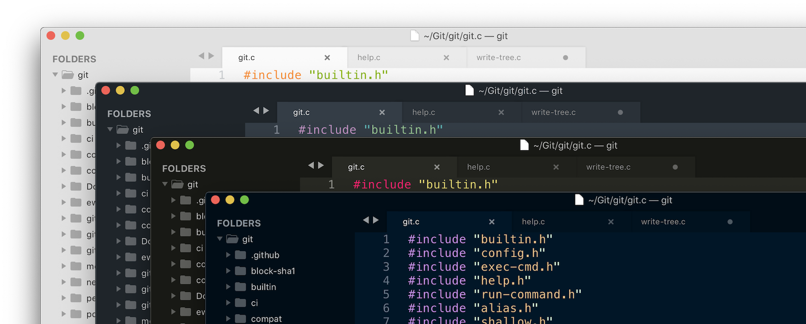

# Sublime Minimal Tabs

A simple Sublime Text theme based on the default Adaptive theme, with clean minimal tabs instead of the slanted detailed ones. The theme should support every color scheme, light or dark.

## Installation

The package is currently not in Package Control, but it can be installed manually.

1. Open the Command Palette (⌘⇧P or Ctrl⇧P)
2. Choose "Package Control: Add Repository"
3. Enter `https://github.com/rosvik/sublime-minimal-tabs`
4. Open the Command Palette again (⌘⇧P or Ctrl⇧P) 
5. Choose "UI: Select Theme" then "minimal-tabs.sublime-theme"
